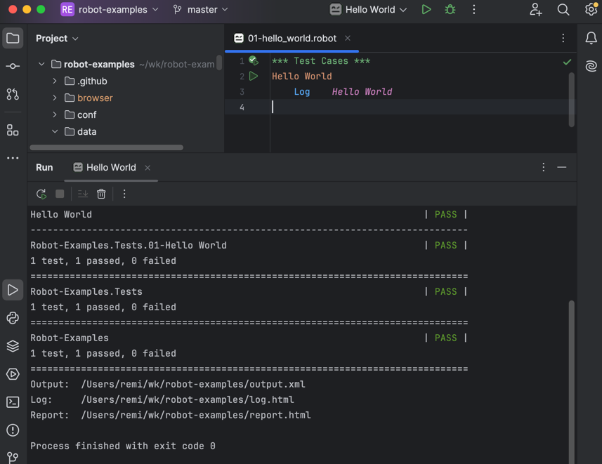
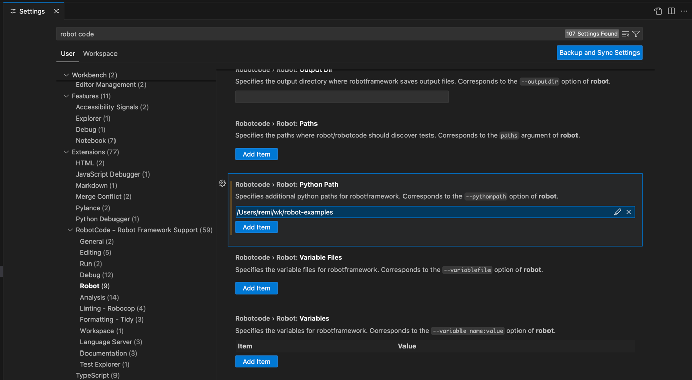
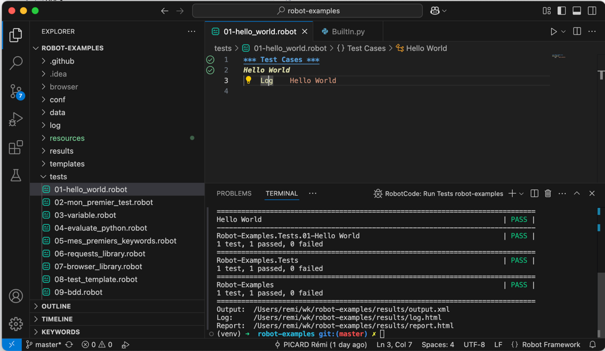

# Configuration des IDEs

Pour améliorer votre productivité lors du développement de tests Robot Framework, il est essentiel de configurer correctement votre environnement de développement. Cette section vous guide dans la configuration de PyCharm et VSCode.

## Configuration de PyCharm

PyCharm offre un excellent support pour Robot Framework avec des plugins dédiés.

Suivez les étapes présentées par [Set up your IDE](https://docs.robotframework.org/docs/getting_started/ide#pycharm){target="_blank"}.

En résumé :

- Installer PyCharm Community Edition
- Installer l'extension `Hyper RobotFramework Support`

!!! warning "Choisir le bon plugin"
Ne pas installer `Robot Framework Language Server` qui n'est pas compatible Robot Framework 7+

!!! info "Autre plugin à tester"
[Robot Code](https://plugins.jetbrains.com/plugin/26216-robotcode--robot-framework-support){target="_blank"} sortie en 2025


### Fonctionnalités disponibles dans PyCharm

- ✅ **Coloration syntaxique** complète
- ✅ **Auto-complétion** des mots-clés
- ✅ **Navigation** vers les définitions
- ✅ **Refactoring** des mots-clés
- ✅ **Exécution directe** des tests
- ✅ **Débogage** des tests



---

## Configuration de VSCode

VSCode avec les bonnes extensions offre une excellente expérience de développement pour Robot Framework.

Suivez les étapes présentées par [Set up your IDE](https://docs.robotframework.org/docs/getting_started/ide#visual-studio-code){target="_blank"}.

En résumé :

- Installer [VS Code](https://code.visualstudio.com){target="_blank"}
- Installer l'extension [Robot Code](https://marketplace.visualstudio.com/items?itemName=d-biehl.robotcode){target="_blank"}

!!! warning "Choisir le bon plugin"
Ne pas installer `Robot Framework Language Server` qui n'est pas compatible Robot Framework 7+

Configurer le Python Path dans les options RobotCode :



### Fonctionnalités disponibles dans VSCode

- ✅ **Coloration syntaxique** avancée
- ✅ **Auto-complétion** intelligente
- ✅ **Validation** en temps réel
- ✅ **Navigation** vers les définitions
- ✅ **Outline** de la structure du fichier
- ✅ **Exécution** directe des tests
- ✅ **Intégration terminal**



### Snippets utiles pour VSCode

Créez le fichier `.vscode/robotframework.code-snippets` :

```json
{
    "Robot Test Case": {
        "prefix": "test",
        "body": [
            "${1:Test Case Name}",
            "    [Documentation]    ${2:Test description}",
            "    ${3:# Test steps here}",
            "    Log    ${4:Test completed}"
        ],
        "description": "Create a new Robot Framework test case"
    },
    "Robot Keyword": {
        "prefix": "keyword",
        "body": [
            "${1:Keyword Name}",
            "    [Documentation]    ${2:Keyword description}",
            "    [Arguments]    ${3:\\${arg1}}",
            "    ${4:# Keyword implementation}",
            "    Log    ${5:Keyword executed}"
        ],
        "description": "Create a new Robot Framework keyword"
    }
}
```

Pour utiliser ces [snippets](https://code.visualstudio.com/docs/editing/userdefinedsnippets){target="_blank"} : actionnez l'IntelliSense (`Ctrl+Space` ou `⌃Space`).

---

## Conseils pour optimiser votre workflow

!!! tip "Raccourcis utiles"
**PyCharm:**

- `Ctrl+B` : Aller à la définition
- `Alt+Enter` : Actions rapides

**VSCode:**

- `Ctrl+Shift+P` : Palette de commandes
- `F12` : Aller à la définition
- `Ctrl+` : Terminal intégré

!!! info "Formatage automatique"
Activez le formatage automatique dans votre IDE pour maintenir une syntaxe cohérente dans vos fichiers Robot Framework.

!!! warning "Attention aux chemins"
Assurez-vous que les chemins vers votre environnement virtuel Python sont corrects dans la configuration de votre IDE.

## Prochaines étapes

Maintenant que votre environnement de développement est configuré, vous êtes prêt à créer des tests plus complexes et à utiliser toutes les fonctionnalités avancées de Robot Framework.

Dans la [prochaine section](api-booker.md), nous allons mettre en pratique vos connaissances avec un exercice complet de test d'API REST.